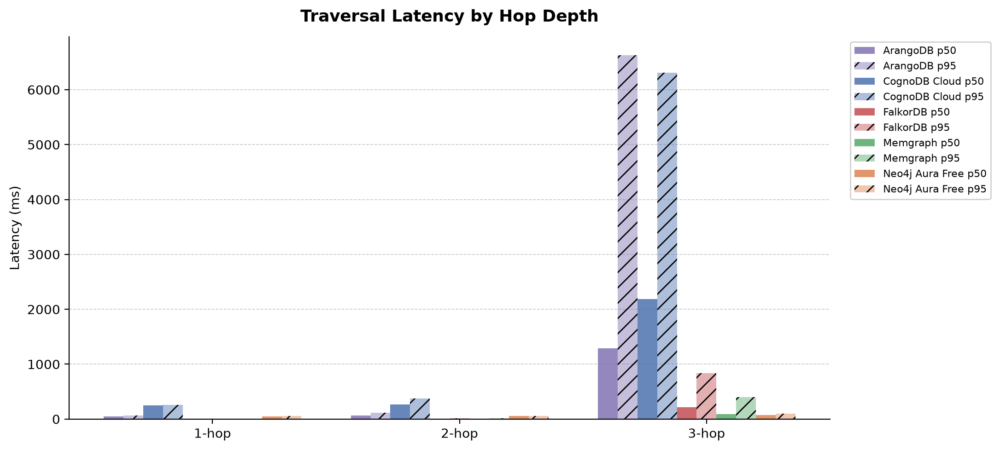
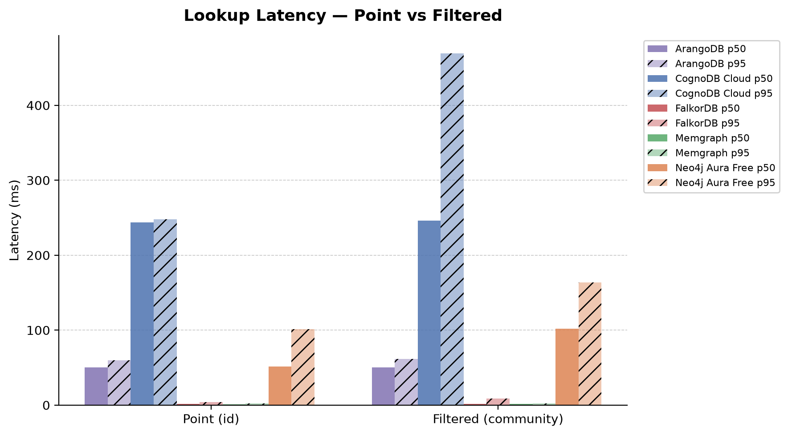
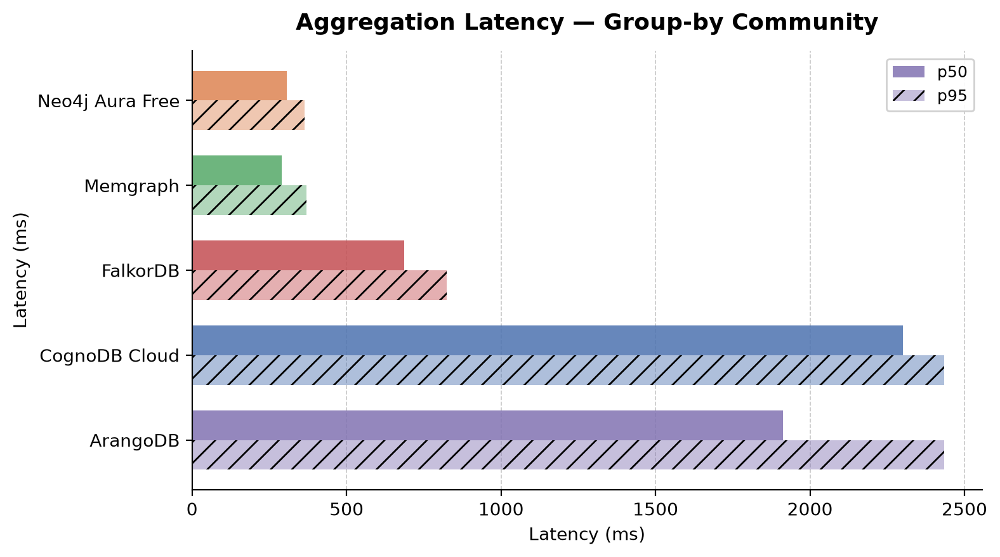
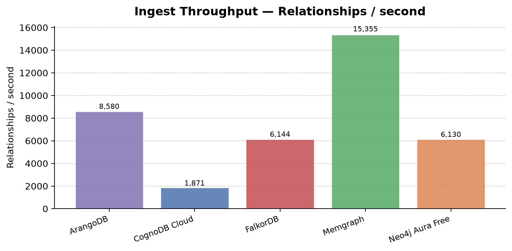
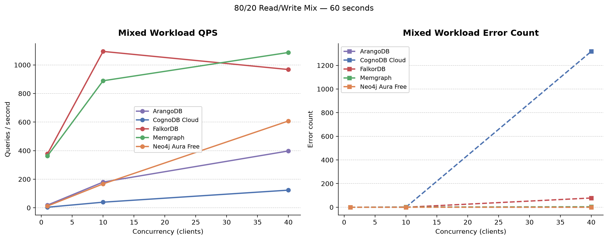

# Benchmark Results Report

Auto-generated by `graph-bench report` from `results/latest.json`.

## Instance Specifications

| Platform        | Tier            | vCPU   | RAM (MB)                     | Storage (GB)                 |
|-----------------|-----------------|--------|------------------------------|------------------------------|
| ArangoDB        | Docker (capped) | 0.5    | 256                          | 1                            |
| CognoDB Cloud   | c0 Free         | 0.5    | 256                          | 1                            |
| FalkorDB        | Docker (capped) | 0.5    | 256                          | 1                            |
| Memgraph        | Docker (capped) | 0.5    | 256                          | 1                            |
| Neo4j Aura Free | AuraDB Free     | shared | ~256 (instance memory limit) | ~0.5 (node/rel limits apply) |

## Data Loading

| Platform        |   Load time (s) |   Nodes/s |   Rels/s | Method                                                   |
|-----------------|-----------------|-----------|----------|----------------------------------------------------------|
| ArangoDB        |           17.48 |     4,236 |    8,580 | ArangoDB import_bulk (1000 docs/batch)                   |
| CognoDB Cloud   |           80.18 |       924 |    1,871 | Neo4j Python driver UNWIND batch MERGE (1000 rows/batch) |
| FalkorDB        |           24.41 |     3,034 |    6,144 | FalkorDB Cypher UNWIND batch (1000 rows/batch)           |
| Memgraph        |            9.77 |     7,582 |   15,355 | Neo4j Python driver UNWIND batch MERGE (1000 rows/batch) |
| Neo4j Aura Free |           24.47 |     3,027 |    6,130 | Neo4j Python driver UNWIND batch MERGE (1000 rows/batch) |

## Cold-Start vs Warm Traversal Latency

> Cold-start: single 1-hop query immediately after data load, before any warm-up.
> Warm: p50/p95 over ≥100 iterations after 10 warm-up rounds.

| Platform        | Cold 1-hop   | 1-hop (warm)             | 2-hop                    | 3-hop                               |
|-----------------|--------------|--------------------------|--------------------------|-------------------------------------|
| ArangoDB        | 67.3 ms      | p50=50.0 / p95=62.3 ms   | p50=64.0 / p95=116.2 ms  | p50=1289.9 / p95=6629.9 ms          |
| CognoDB Cloud   | 312.4 ms     | p50=252.3 / p95=259.1 ms | p50=263.7 / p95=379.4 ms | p50=2184.1 / p95=6306.9 ms ⚠ 77 err |
| FalkorDB        | 7.0 ms       | p50=1.1 / p95=2.1 ms     | p50=3.4 / p95=14.5 ms    | p50=218.5 / p95=834.4 ms ⚠ 9 err    |
| Memgraph        | 42.0 ms      | p50=2.5 / p95=4.9 ms     | p50=4.7 / p95=16.6 ms    | p50=86.2 / p95=401.1 ms             |
| Neo4j Aura Free | 70.2 ms      | p50=52.1 / p95=61.0 ms   | p50=52.8 / p95=58.9 ms   | p50=70.8 / p95=100.6 ms             |

## Lookups

> Indexes on `Person.id` (point) and `Person.community` (filtered) on every platform.

| Platform        | Point lookup (id)                | Filtered lookup (community)   |
|-----------------|----------------------------------|-------------------------------|
| ArangoDB        | p50=50.1 / p95=59.5 ms           | p50=50.4 / p95=61.5 ms        |
| CognoDB Cloud   | p50=243.9 / p95=247.9 ms ⚠ 4 err | p50=246.0 / p95=469.4 ms      |
| FalkorDB        | p50=1.5 / p95=3.9 ms             | p50=1.8 / p95=9.0 ms          |
| Memgraph        | p50=0.9 / p95=2.3 ms             | p50=1.5 / p95=2.4 ms          |
| Neo4j Aura Free | p50=51.3 / p95=101.1 ms          | p50=102.0 / p95=163.8 ms      |

## Aggregations

> Top-10 communities by neighbour count — closest to an analytic scan.

| Platform        | Group-by community (top 10)   |
|-----------------|-------------------------------|
| ArangoDB        | p50=1911.7 / p95=2434.7 ms    |
| CognoDB Cloud   | p50=2301.1 / p95=2434.0 ms    |
| FalkorDB        | p50=686.2 / p95=824.6 ms      |
| Memgraph        | p50=290.0 / p95=371.1 ms      |
| Neo4j Aura Free | p50=306.3 / p95=364.7 ms      |

## Mixed Workload (80/20 read/write)

| Platform        |   Concurrency |    QPS |   Total queries |   Errors |
|-----------------|---------------|--------|-----------------|----------|
| ArangoDB        |             1 |   19   |            1140 |        0 |
| ArangoDB        |            10 |  180.1 |           10805 |        2 |
| ArangoDB        |            40 |  397.8 |           23867 |        0 |
| CognoDB Cloud   |             1 |    4   |             243 |        0 |
| CognoDB Cloud   |            10 |   39.3 |            2358 |        0 |
| CognoDB Cloud   |            40 |  123.6 |            7414 |     1318 |
| FalkorDB        |             1 |  377.4 |           22642 |        0 |
| FalkorDB        |            10 | 1094.5 |           65667 |        0 |
| FalkorDB        |            40 |  967.8 |           58065 |       78 |
| Memgraph        |             1 |  363.1 |           21789 |        0 |
| Memgraph        |            10 |  889.1 |           53346 |        1 |
| Memgraph        |            40 | 1087.1 |           65224 |        4 |
| Neo4j Aura Free |             1 |   12.3 |             736 |        0 |
| Neo4j Aura Free |            10 |  167.3 |           10036 |        0 |
| Neo4j Aura Free |            40 |  607.6 |           36458 |        0 |

## Footprint

| Platform        | Stored size                                   | Memory                              | Notes                                                                                                                                                            |
|-----------------|-----------------------------------------------|-------------------------------------|------------------------------------------------------------------------------------------------------------------------------------------------------------------|
| ArangoDB        | 74,062 vertices, 150,000 edges                | not observable (community edition)  |                                                                                                                                                                  |
| CognoDB Cloud   | not observable                                | not observable                      | Couldn't connect to db-e01bc678.bravo.databases.cognodb.com:7687 (resolved to ('136.70.132.96:7687',)):                                                          |
|                 |                                               |                                     | Failed to establish connection to ResolvedIPv4Address(('136.70.132.96', 7687)) (reason [WinError 10065] A socket operation was attempted to an unreachable host) |
| FalkorDB        | 74,062 nodes, 150,000 relationships           | 31.49M                              |                                                                                                                                                                  |
| Memgraph        | 74,062 nodes, 150,000 relationships (logical) | capped at 256 MB via docker compose | Cloud consoles may expose additional metrics.                                                                                                                    |
| Neo4j Aura Free | 74,062 nodes, 150,000 relationships (logical) | not observable (managed cloud)      | Cloud consoles may expose additional metrics.                                                                                                                    |

## Charts

